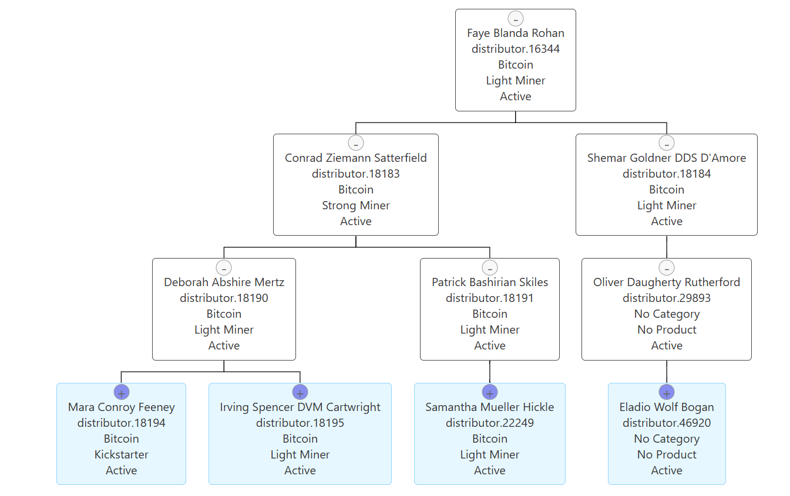
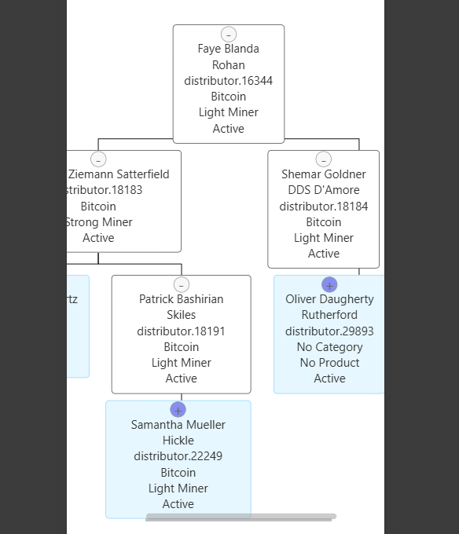

# Daxcsa Company - Genealogy Tree

A simple project to manage and visualize tree structures, specifically designed for genealogy purposes.

## External Resources

- TreantJS: A JavaScript library for creating tree diagrams.

## Getting Started

To get started with the Daxcsa Company Genealogy Tree project, follow these steps:
1. Clone the repository:
    ```bash
    git clone https://github.com/carlosespejel23/daxcsa_tree_chart.git
    ```
2. Navigate to the project directory:
    ```bash
    cd daxcsa_tree_chart
    ```
3. Open the `index.html` file in your web browser to view the genealogy tree. It is necessary to have a local server running to properly view the project, as it uses JavaScript and CSS files.

## Project Images

**Default view of the genealogy tree:**



**Responsive design of the genealogy tree:**

